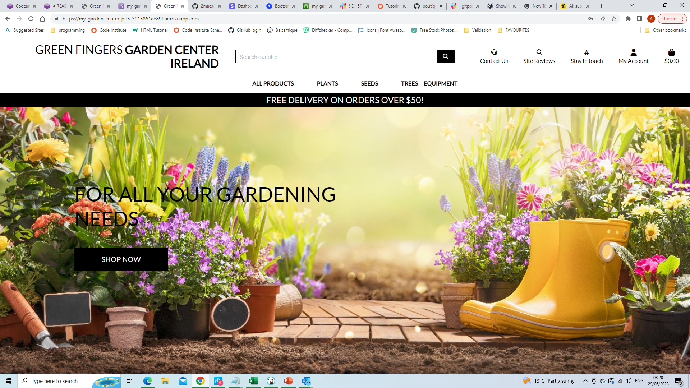
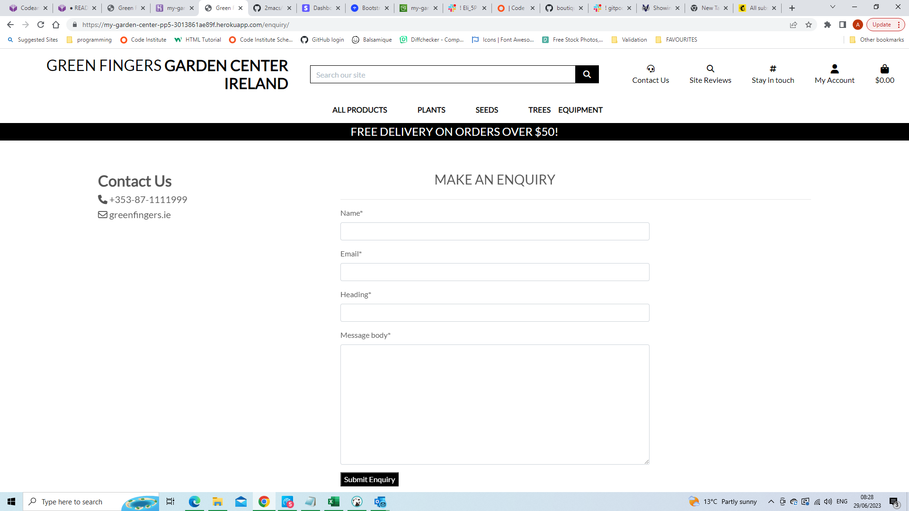
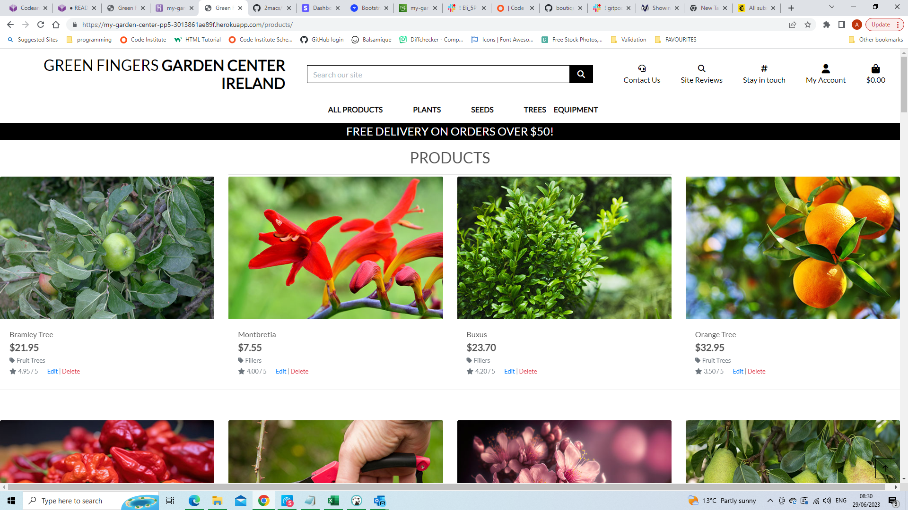
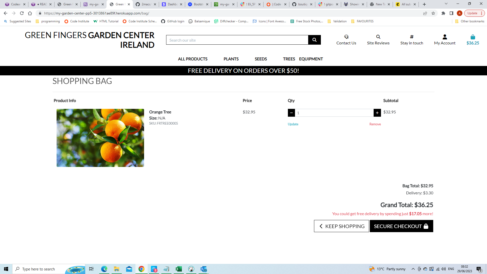
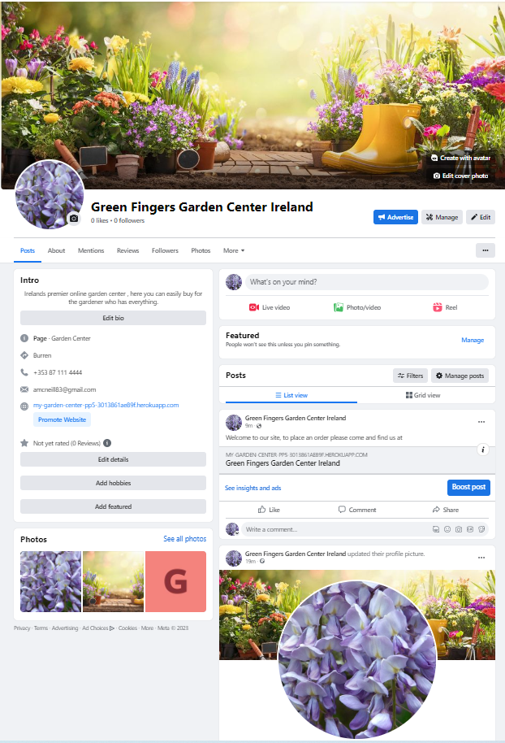

# 
 Green Fingers Garden Center Ireland 

## Purpose

Welcome to Green Fingers Garden Center Ireland. The purpose of this site is to provide a fully functioning e-commerce platform to enable enthusiastic gardeners of all standards to purchase great plants , seeds, trees and equipment and have these items deivered to the door.

## Goal

Our goal is to ensure that location is no impediment to enjoying this amazing and greatly satisfying pastime. Our site has been designed with the gardener in mind and all our products come with clear pictures, product description and planting instructions.
The site has been designed to be used on PC but also on the move and all functionality is available on mobile platforms.

## Target Audience

Research into potential users / customers have revealed that the following represent our target audience;

1. Experienced Gardeners - will use the site to search for a specific plant / seed / tree that may not be available locally currently. Or the customer may be in a remote area , far from a garden center and requiring home delivery.
2. Beginner / curious gardeners - these are people that may be watching gardening shows on TV and wondering if they have an interest in gardening and would like to "have a go". These people may be a little nervous about going to a garden center as they may feel they are asking stupid or basic questions. Thus, being able to find what they want, order it and try it is what they are looking for. Other people in this persona may have a very small garden or a few plants and dabble in gardening from time to time, again, they want to see and find something attractive quickly, be able to pay for it and get it delivered to the door.
3. Niche Gardeners - these are people with a specific interest, e.g. I want to grow the hottest chilli I can or I want to grow apple trees etc.
4. Friends / families of gardeners - these are people that may know very little about gardening but will know what their friends / partners like and would be interested in buying gifts around gardening. These gifts tend to be longer lasting and are associated with the gift giver for a long period of time so these people also want to make a statement about their friendship / relationship to the gardener.
5. Random customers - this group may be searching for a gift for a non-gardener or for themselves that is just a bit different from the norm and could be interpreted as thoughtful.

Please see [SEO_Keyword_Research.d](SEO_Keyword_Research.md)

We aim to address the needs of these groups by providing a well laid out website that supports the purchase of garden products from 'soup to nuts', also we conducted keyword reseacrch designed to make finding this website easier and more likely for people searching. The site also provides product descriptions and instructions and gives the cutomers a chance to view reviews of our site and leave enquiries / questions.

## Business and Customer Goals

### Business Goals

Goals of the business are as follows;

* Increase Revenue - This is the primary objective for any business ! The garden Center E-Commerce Platform should boost the garden center's revenue by expanding its customer base and increasing sales. The platform aims to attract both existing and new customers by providing a user-friendly and efficient online shopping experience.
* Expand Market Reach - By establishing an online presence, the garden center can extend its market reach beyond the local area. The platform should enable customers from different areas and regions to access and purchase products, thus increasing business growth and getting to more customers.
* Enhance Customer Experience- a key business goal is to provide an enjoyable and seamless shopping experience for customers. The platform should be intuitive, visually appealing, and responsive across various devices, ensuring a smooth browsing and purchasing process. Providing features like search functionality, product categorisation, and customer reviews enhance the overall experience.
* Improve Product Visibility: The e-commerce platform should showcase the garden center's products, make it easy for customers to find and explore our products. Clear and comprehensive product descriptions, high-quality images and clear instructions can promote sales.
* Enable Secure Transactions: The site use tried and trusted STRIPE online payment system as building customer trust is crucial for any e-commerce platform. Stripe provides secure payment gateways and is known to be reliable and safe.
* Order Management - the site should provide a user-friendly order management system , communicate with customers regarding their purchases and keep a history of customer purchases so the customer can see wthat they have purchased previously or not purchased previously!
* Enhance Customer Care - the site should facilitate customer interactions such as responding to queries, subscribing to newsletters. Prompt and accurate responses increase customer satisfaction and loyalty.
* Scale in the future - As the business grows the site should be able to grow with it. It should be straightforward to add new features , increase product ranges etc.

### Customer Goals

* Convenience: Online shopping allows customers to browse and purchase items from the comfort of their own homes, saving them time, effort and money when compared to visiting physical stores. Online shoping also offers the convenience of having products delivered straight to their door.
* Product Information: Customers shopping online for plants and garden equipment will gain a lot of confidence from detailed product descriptions and high-quality images. They may also want access to comprehensive instructions about planting etc. enabling them to make informed decisions.
* Reviews and Recommendations: Online shoppers often rely on customer reviews and ratings to assess the quality and performance of products. Reviews and ratings from other customers to help them gauge the reliability and suitability of the products they seek to buy.
* Selection: Online stores may offer products that local shops may not offer. Customers may be looking for diverse sproducts such as hard to find chilli varieties etc.
* Expert Advice and Support: Some customers may require guidance or assistance in selecting the right plants or equipment for their specific needs. A future enhancement for the site may be to offer videos / tutorials etc.
* Sustainability: more customers are concerned with sustainable practices thus buying online may be preferential to driving, parking etc. Care should also be taken not to annoy such customers with excessive packaging.

## UI/UX design

### Wireframes

Please see [wireframes.md](wireframes.md)

The colour scheme is based on the Boutique-Ado walkthrough. For forms etc. the overlay of a white background and black text provides clean lines and unfussy web pages.
Google fonts was used to implement the Lato font across the website.

### Site Features

The site features a very attractive landing page witha high quality image of a gardening scene, the home page also features a banner that persists throughout site and easy to read / access menu items.

The site featurs an ability to create and enquiry and see how to contact us,

The site has a fully loaded products catalogue, with high quality pictures.

The user can craete a shopping bag and place an order

The site also has an associated facebook page 

and a facility to sign up our monthly newsletters.

## Database Design

### ERD

Please see [ERD](erd.md)

* As per the diagram each product can have a single category, a category can have many products.
* Each lineitem has a single product.
* Auth user is connected in many places as a foreign key especially profiles table, reviews table , comments table.
* There is a connection between profiles and orders to ensure a user has access to their order history.

As well as the models provided by allauth and Boutique-Ado there are 3 custom models developed - SiteReviews, Comments and MakeEnquiry.

## Marketing

Please see [ecommerce_strategy.md](ecommerce_strategy.md)

## Facebook Mockup

Please see [FaceBook_Mockup](Extra_Images/facebook/facebook.PNG)

## User Stories

The following user stories were identified and created as issues in GitHub;

### User Story

-----------------------------------------------------------------------------------

As  **Customer** I want to **have the same experience across different devices and screen sizes** so that I can **move from one to the other and customer experience is the same**

### Acceptance Criteria

* The app is responsive across different devices and screen sizes

### Tasks

* [ ] Check app across different devices and screen sizes

* [ ] Develop bootstrap / css to maintain customer experience across eh different screen sizes

--------------------------------------------------------

### User Story

As  **Customer** I want to **add items to my shopping cart** so that I can **view the contents of my shopping cart**

### Acceptance Criteria

* Selected items appear in the shopping cart.
* Associated prices appear in the shopping cart
* Total price for all items is available in shopping cart

### Tasks

* [x] For the product detail, add an 'Add to Cart' button.

* [x] Add the product and product qty to the shopping cart
* [x] Update the total cart cost
* [x] Show the updated cart to the customer.

----------------

### User Story

As  **Customer** I want to **be able to update qty , add or remove line items form the shopping cart prior to making a purchase** so that I can **buy exactly what I want**

### Acceptance Criteria

* Customer can add / remove line items, cart pricing will update.  Message confirming action is generated.
* Customer can adjust selected quantities, cart pricing will update. Message confirming action is generated.

### Tasks

* [x] For each line item implement Add / Remove buttons, amend cart value, generate message to user.

* [x] For each line item, add functionality to adjust selected qty, amend cart value, generate message to user.

### Issues

* [x] When the order qty was adjusted, the total price updated but not the line item price. Forgot to call adjust_item_qty and pass it qty and price.

----------------------

### User Story

As  **Customer** I want to **see product details when I select a product** so that I can **find out more about that product**

### Acceptance Criteria

* When a customer selects a product , a product detail page appears
* The customer can return to home page from the product detail page
* The customer can return to the products page from the product detail page

### Tasks

* [x] Develop html and CSS for the product detail page

* [x] Develop views and URLs to map the product detail page.
* [x] Enable customer to navigate around the site from the product detail page.
* [x] The product detail should include a product image, description, price.

------------------------

### User Story

As an **admin** I want to **respond promptly to customer enquiries** so that I can **respond quickly to customer needs and questions**

### Acceptance Criteria

* Customer can create an enquiry and submit the enquiry
* Enquiry can be viewed by the admin in the admin panel
* Enquiry can be viewed by the admin in the app without using the admin panel
* Email confirmation sent to the customer
* Email sent to the admin telling the admin a new enquiry has been generated

### Tasks

* [x] Create Enquiry data model and associated form

* [x] Generate message on screen to Customer that Enquiry has been submitted
* [x] Generate Email to customer that Enquiry has been submitted
* [x] Generate Email to admin detailing that enquiry has been submitted
* [x] Update the admin panel with new Enquiry

----------------------------------------------------------------

### User Story

As  **Customer** I want to **the app to be visually appealing and user friendly** so that I can **focus on the shopping experience and not focus on navigating / using the app**

### Acceptance Criteria

* Main navigation links are available on all pages
* Use of colors , fonts etc. are consistent across the site
* Use of graphics / images where possible to enhance the visual appeal of the site

### Tasks

* [x] Create a base template , consistent across all pages.

* [x] Create std set of colors.
* [x] Seamless navigation around the site, products/cart etc. always available.

------------------------------------

### User Story

As a site owner I want to have a facility that allows a user to subscribe to our site so that I can keep the customer informed about offers etc.

### Tasks

* [x] Select a subscriber service - MailChimp recommended
* [x] Add user option to main header bar, footer doesn't fit with site UX.

### Bugs

* [x] Deployed site crashed when code from mailchimp incorporated, found html, css and JS code through Chrome.

------------------------------------------

### User Story

As  **Customer** I want to **I want to view my order history** so that I can **see what I purchased in the past**

### Acceptance Criteria

* Users profile setup
* View order history by user profile

### Tasks

* [x] Develop user profile functionality

* [x] Develop template to display order history to user
* [x] User can only see own order history, another user cannot view the current users order history.

---------------------------------------

### User Story

As  **customer** I want to **proceed to checkout and provide shipping and billing information** so that I can **get products delivered to a location that best suits me and pay online**

### Acceptance Criteria

* User has access to a form requesting shipping address details.
* User can input credit card details to pay for the products.
* User gets payment success / payment failure messages as appropriate.

### Tasks

* [x] Create shipping/ billing form.

* [x] Add field for credit card information
* [x] Implement STRIPE functionality
* [x] Implement webhooks to ensure no issues with interrupted / semi complete transactions.
* [x] Generate email to customer detailing order summary and order cost.

### Issues

* [x] Webhooks returning an error, checking the endpoint is correct  - needed to make port public and include import stripe at top of webhook handler.

-----------------------------------------------

### User Story

As  **customer** I want to **receive email notifications confirming my order** so that I can **be sure my order has been processed correctly**

### Acceptance Criteria

* On creation of a successful order, an email order confirmation is sent to the customer.

### Tasks

* [x] Setup email in Django to send an Email to a customer

* [x] Create email message body and header bodies

---------------------

### User Story: Product Management

As  **admin** I want to **be able to add new products, update existing products, and remove products from the app** so that I can **keep control of the product offering**

### Acceptance Criteria

* Create an admin panel allowing for addition, editing and removal of products from the app.
* Admin panel is only accessible to a logged in admin user.
* Create templates to allow addition, removal and editing of products without going to admin panel.
* Product Management functionality can only be accessed by a logged in admin.

### Tasks

* [x] Register data models in Django to create an admin panel.
* [x] Create super user to access the admin panel.
* [x] Create navigation to product management templates.
* [x] Create Product Management templates.
* [x] Use product management templates, confirm results in admin panel.

------------------------------

### User Story

As  **Customer** I want to **log in and create an account** so that I can **have a more personal and secure experience in the app**

### Acceptance Criteria

* User can log into the app, user is informed when log in is successful
* User can log out of the app, user is informed when logout is successful
* If the user has not already done so, the user is directed to register to create an account, user is informed when registration is successful

### Tasks

* [x] Using Django allauth install the relevant functionality to control login/logout/registration

* [x] Create the login template
* [x] Create the logout template
* [x] Create the registration template
* [x] Implement messaging for above actions

-----------------------

### User Story

As a **Customer** I want to **view all products** so that I can **browse through them and see what is available**

### Acceptance Criteria

* Clicking on the All products link shows the customer all the products available to buy.
* Products should be rows of 3 on large screens.
* Products  should be stacked one on top of each other on small screens.

### Tasks

* [x] Determine which products will be included in the site

* [x] Define product categories
* [x] Develop functionality to enable customer to view all products, 3 per row on large screens.
* [x] Develop functionality to enable the customer to view products by category.

### Bugs

* [x] Images for the products are different sizes, need to resolve in CSS. Decided to cut the images to sizer re-submit to the app.

* [x] Background Image on index.html not appearing today.

---------------------------------------

## Manual Testing

### See testing document
['Functional Testing'](testing.md 'testing.md')

## Technologies Used

The following technologies were used in this app:

* HTML / CSS / JQuery were used to design and style the webpages.
* Python3.8.12 was used for the Python coding.
* Django 3.2.18. provides the app framework.
* Bootstrap 4.4.1
* Google fonts was used to import the Lato font.
* Font Awesome provides icons throughout the site, especially Home page and Explore page.
* codeanywhere - used for version control by utilizing the terminal to commit to Add, Commit and Push to GitHub.
* GitHub - used to store the projects code after being pushed from Git.
* AWS - used to host / store images and staticfiles used in the app.
* Heroku - used to host the final released web site.
* Postgres used as database.
* Pillow was used to manage images in Django
 

 

## References and Credits

* <https://www.gardenersworld.com/how-to/grow-plants/>
* <https://thegoodearthgarden.com/camellia-care-planting-tips/#:~:text=Camellia%20care%20is%20pretty%20simple>,conditions%20to%20encourage%20new%20growth.
* <https://www.gardens4you.ie/garden-plants/perennials/hosta>
* <https://www.missouribotanicalgarden.org/PlantFinder/PlantFinderDetails.aspx?taxonid=243283#:~:text=Buxus%20sempervirens%20is%20a%20rounded>,as%2020%2D30'%20tall.
* <https://hayloft.co.uk/growingsaxifraga#:~:text=Saxifraga%20are%20best%20suited%20to>,and%20width%20of%20your%20plant.
* <https://www.thespruce.com/orange-tree-growing-guide-6541613>
* <https://www.quickcrop.ie/product/pepper-chilli--jalapeno>
* <https://www.lovemychillies.co.uk/carolina-reaper#:~:text=The%20Carolina%20Reaper%20is%20officially>,out%20at%202.2%20Million%20SHU!
* <https://www.hss.gov.nt.ca/en/services/nutritional-food-fact-sheet-series/lettuce#:~:text=Lettuce%20is%20a%20leafy%20green>,helps%20keep%20our%20bodies%20healthy.
* <https://johnstowngardencentre.ie/seeds-bulbs/seeds/lettuce-seeds.html>
* Stack Overflow - numerous questions and sites followed.
* <https://docs.djangoproject.com/en/4.1/>
* Django 4 by example, Antonio Mele.
* Code Institute - Boutique-Ado walkthrough.
* <https://www.geeksforgeeks.org/django/>

## Procedures

### Heroku

* Login to Heroku , if you dont have an account you will need to create one.
* On your dashboard , click 'New'
* Click 'Create new app'
* Create an app name and Region, click Create App
* In config vars you will need
  * AWS_ACCESS_KEY_ID - this is AWS publishable key
  * AWS_SECRET_ACCESS_KEY - this is AWS password / access key
  * DATABASE_URL - path to ElephantSQL postgres database
  * EMAIL_HOST_PASS - key from email provider granting access to the app.
  * EMAIL_HOST_USER - your email address / login
  * SECRET_KEY - made up key held in Django
  * STRIPE_PUBLIC_KEY - use test version from Stripe
  * STRIPE_SECRET_KEY - use test version from Stripe
  * STRIPE_WH_SECRET - key for stripe webhooks
  * USE_AWS - define if using AWS to store static files and media files.
* In buildpacks add the heroku/python buildpack.
* To deploy to Heroku
  * Click Deploy on Heroku menu
  * Under Deployment method select GitHub
  * Connect App to GitHub repo
  * In automatic deploys enable automatic deploys, each time you push to GitHub your app will be deployed to Heroku.
  * Check Activity and ensure your app is both building successfully and eploying successfully to Heroku.
  * Click OpenApp and check deployed app is behaving as expected.

### AWS Bucket creation

* Login to AWS , if you dont have an account you will need to create one.
* Navigate to the Amazon S3 service.
* Click on "Create bucket" to start the bucket creation process.
* Provide a unique name for your bucket. Note that bucket names must be globally unique across all AWS accounts.
* Choose the region where you want to create the bucket. Consider selecting a region that is geographically close to your users for better performance.
* Click on "Create" to create the bucket.
* Navigate to the IAM (Identity and Access Management) service in the AWS Management Console.
* Click on "Groups" in the sidebar and create a group if you don't have one already e.g manage-my-garden-center.
* Add users to the group or create individual users.eg my-garden-center-staticfiles-user.
* Click Create Policy
* select policy required, copy JSON into policies section.
* Define the necessary permissions for the S3 bucket, such as read, write, or delete access.
* Ensure the policy is attached to the group.
* In django ensure that you are no longer connected to local server and run python manage.py collectstatic, should now be a static folder in your folder.
* In the bucket, create a media folder and upload all required pictures etc into the media folder.
* Your Heroku app should be styled correctly and displaying your images.

### Stripe Configuration

* Login to Stripe, if you dont have an account you will need to create one.
* Under API keys copy your publishable key and secret key, these will be needed for the Heroku config vars referenced above.
* Ensure you are using test versions.
* Under webhooks create a new endpoint, use your heroku url.
* Under signing secret , copy your signing secret for webhooks, this will be needed for Heroku CONFIG VARS.
* To use stripe in django run pip install stripe in terminal.

All required installs are included in requirements.txt, these can be installed by running pip install -r requirements.txt in the terminal.

## Future Work

* Change stripe keys to production keys to take actual payments through stripe
* Generate a newsletter and send regularly to subscribers
* Register the site with Google, start analysing data and make enhancements based off the data.
