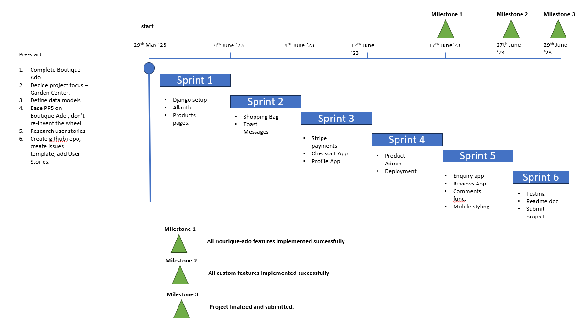
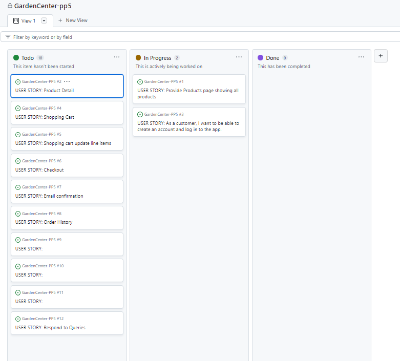
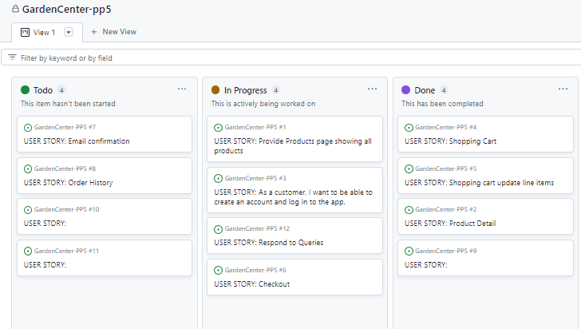
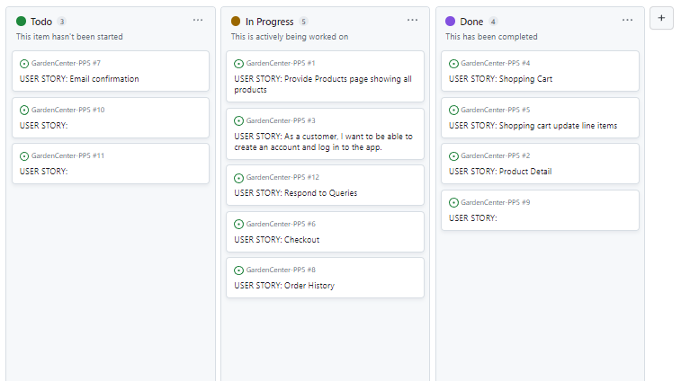
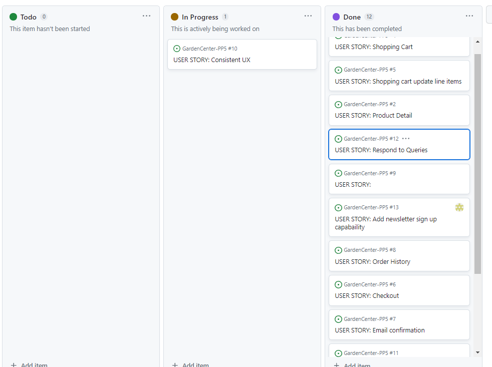

# Agile Planning - Garden Center App

## Purpose

The purpose of this document is to capture User Story development and progress through the project. The screenshots are captured in Extra_/agile_Images.

## Agile Plan

The project was approached as follows;

* Prework was completed as per video around getting ready for PP5. 
* The project was planned over 6 sprints-
  * Sprints 1 - 4 were developing the project in line with boutique-ado
  * Sprint 5 was concerned with developing the 3 custom models and associated views, Templates and Urls
  * Sprint 6 concerned with readme, testing and submission of project.
* Note: the original intention was to have more time to test and write Readme however there were issues / bugs which took up a lot of time.

## User Story Progression

### 29th May 2023 Initial View

### 4th June 2023

### 8th June 2023

### 12th June 2023

### 27th June 2023

