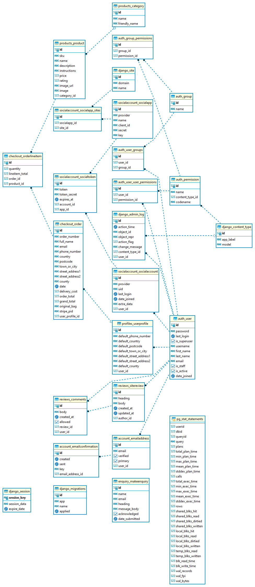

# Entity Relationship Diagram - Garden Center App

## Purpose

The purpose of this document is to capture the Entity Relationship diagram showing the various relationships between the database tables used. The ERD was autogenerated with dBeaver.
reference: AMIS, Data Driven Blog - Oracle & Microsoft Azure
Quick start with free managed PostgreSQL database on ElephantSQL - AMIS, Data Driven Blog - Oracle & Microsoft Azure
by Lucas Jelema.

### ERD

