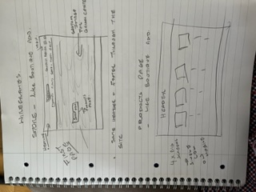
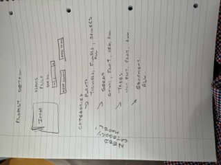
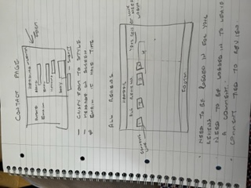
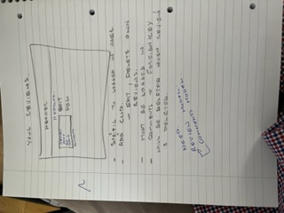
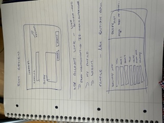
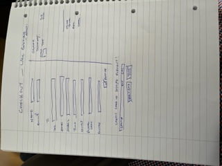

# Project Wireframes - Garden Center App

## Purpose

The purpose of this document is to capture the wire frames / sketches used at the start of this project to help guide the activity. The project may have changed from these wireframes as the development proceeded. Developer finds hand drawn wireframes most efficient.

### Landing Page

First page when the user lands on the app, use Boutiqu-ado as a guide, find a custom background for a garder center app. Clicking products -all products opens the products page. Products will be stacked one at a time for mobile view.

### Product Detail Page

Clicking on the product image brings the user to the product detail page - customise from boutiqu-ado.

### Contact Page

The user can see site email and telephone details and fill out a form to leave an enquiry, first custom model required. Contact details on top followed by form for mobile layout.

### All Reviews

Custom model required for reviews. Custom model required to leave a review specific comment. Will stacked on top of each other for mobile.  

### Your Reviews

User can see their specific reviews and can edit and delete these reviews. User must be logged in.

### Edit a review

User can edit their own reviews. User must be logged in.

### Create user profile

User can create a user profile to hold default delivery data and facilitate order history reporting.User must be logged in.

### Create checkout page

User can provide delivery information, see order detials and stripe element appears here.

